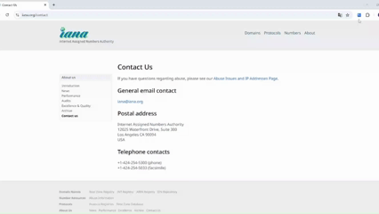
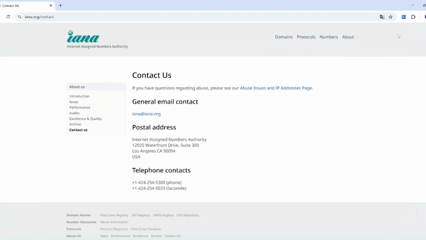

# OpenLinks 扩展程序

## 介绍
OpenLinks 是一个轻量级的 Chrome 扩展程序，在新窗口中以标签页形式批量打开当前页面的链接。

## 功能

- 一键批量打开过滤后的链接，在新窗口中以标签页形式打开
- 提供文本筛选功能，可以根据关键词模糊匹配链接

## 安装
- 方法一：

1. 下载或克隆本项目到本地
2. 打开 Chrome 系浏览器，进入 扩展页面

3. 开启右上角的「开发者模式」
4. 点击「加载已解压的扩展程序」
5. 选择本项目所在的文件夹
- 方法二：
从edge浏览器的扩展程序商店安装 （即将上线）

## 使用说明
1. 安装完成后，点击浏览器右上角的扩展图标打开弹出界面
2. 弹出界面会自动显示当前页面的链接数量
3. 可以选择是否只打开当前域名（`[当前域名]` 复选框）
4. 可以在筛选框中输入关键词，模糊匹配链接
5. 点击「批量打开」按钮，打开过滤后的链接
6. 如果页面内容更新，可以点击「重新获取链接」按钮刷新链接列表

- 添加筛选条件

>如果页面链接过多，可能会造成浏览器卡顿。扩展程序需要获取页面链接的权限，仅用于功能实现，不会收集任何用户数据

